# Bank-API

This application is hosted at the following base URL: https://bank-api-1531.onrender.com/

## Description

This project is a banking API that features password authentication using the `bcrypt` and `express-session` packages. It also uses the popular ORM Sequelize to interact with an PosgreSQL database and model the data.

## Specifications

1. This API uses the following models:

    * `account_type`

      * `id`: integer required primary key auto generated

      * `name`: string required unique

      * one to one relationship with `interest`

      * many to one relationship with `account`

    * `account`

      * `id`: integer required primary key auto generated

      * `balance`: decimal required with a minimum value of 0

      * `account_type_id`: integer references `account_type`.`id`

      * `user_id`: integer references `user`.`id`

      * one to many relationship with `account_type`

      * many to one relationship with `user`

    * `interest`

      * `id`: integer required primary key auto generated

      * `interest_rate`: decimal required with a minimum value of 0

      * `account_type_id`: integer references `account_type`.`id`

      * one to one relationship with `account_type`

    * `user`

      * `id`: integer required primary key auto generated

      * `user_name`: string required unique

      * `hashed_password`: string required

        * `beforeCreate` hook to hash password before storing

        * `beforeUpdate` hook to hash password before storing

        * method to check password

      * one to many relationship with `account`

2. API contains the following routes using Sequelize for interactions with a database:

    * accounts:

      * `GET /api/accounts`

      * `GET /api/accounts/:id`

      * `POST /api/accounts`

      * `PUT /api/accounts/:id`

      * `DELETE /api/accounts/:id`

    * users:

      * `GET /api/users`

      * `GET /api/users/:id`

      * `POST /api/users`

      * `PUT /api/users/:id`

      * `DELETE /api/users/:id`

      * `POST /api/users/login`

      * `POST /api/users/logout`

    * interest:

      * `POST /api/interest/refresh`

        * This route fetches the latest interest rate and then updates the interest rate for all savings accounts.

    * transactions:

      * `POST /api/transactions/transfer/:sender/:receiver`

          * Uses a `Sequelize` _transaction_ to send money between accounts

3. Authenication Requirements:

    * accounts:

      * `GET /api/accounts`

        * Must be logged in

        * May only retrieve accounts associated with the logged in user

      * `GET /api/accounts/:id`

        * Must be logged in

        * May only retrieve accounts associated with the logged in user

      * `POST /api/accounts`

        * Must be logged in

        * May only create accounts associated with the logged in user

      * `PUT /api/accounts/:id`

        * Must be logged in

        * May only update accounts associated with the logged in user

      * `DELETE /api/accounts/:id`

        * Must be logged in

        * May only delete accounts associated with the logged in user

    * users:

      * `GET /api/users`

        * Must be logged in

        * May only retrieve the user associated with the logged in user

      * `GET /api/users/:id`

        * Must be logged in

        * May only retrieve the user associated with the logged in user

      * `PUT /api/users/:id`

        * Must be logged in

        * May only update the user associated with the logged in user

      * `DELETE /api/users/:id`

        * Must be logged in

        * May only update the user associated with the logged in user

    * interest:

      * `POST /api/interest/refresh`

        * Must be logged in

    * transactions:

      * `POST /api/transactions/transfer/:sender/:receiver`

        * Must be logged in

        * Logged in user must be the sender to initiate a transaction

## Request and Response Examples

Accounts:

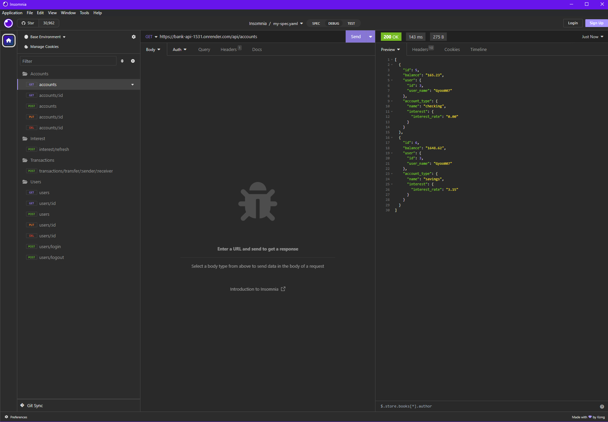

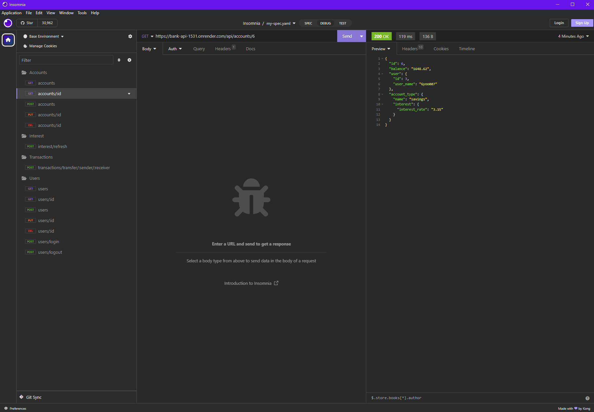

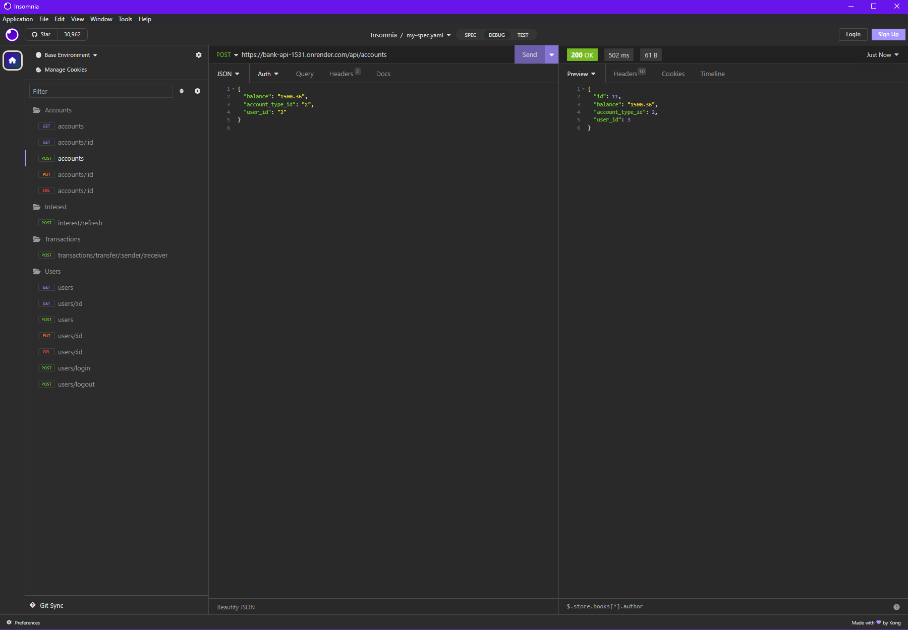

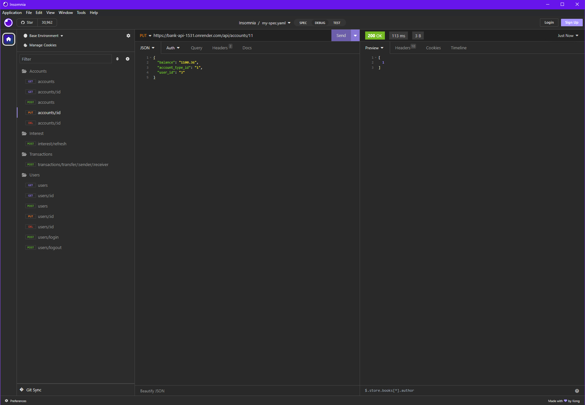

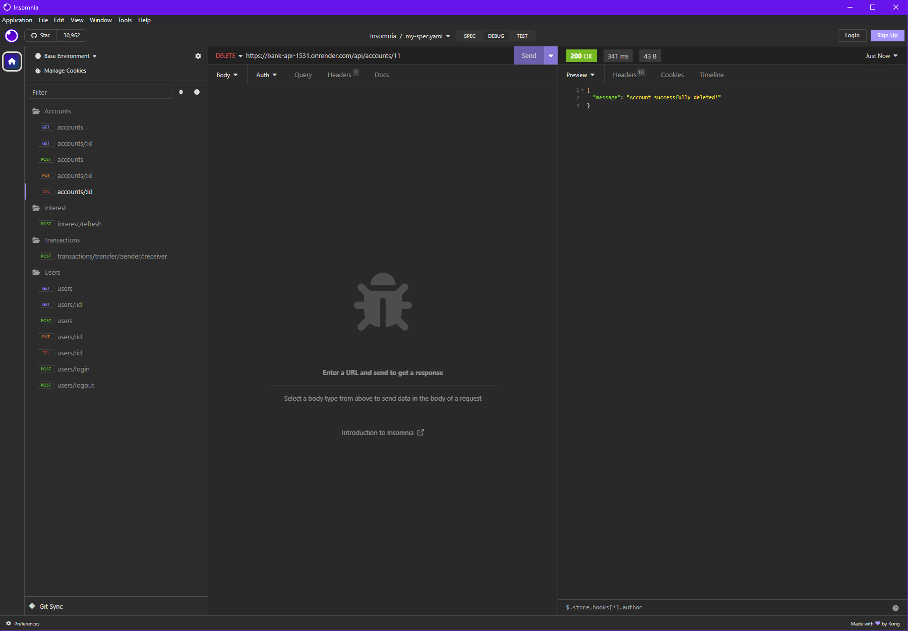

Users:

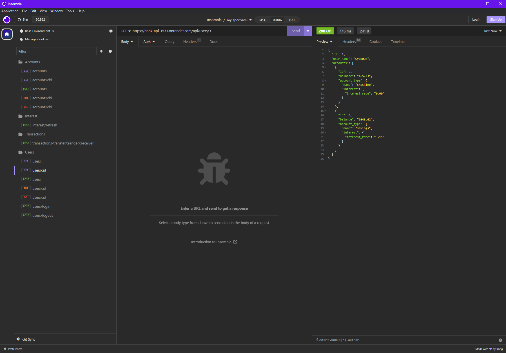

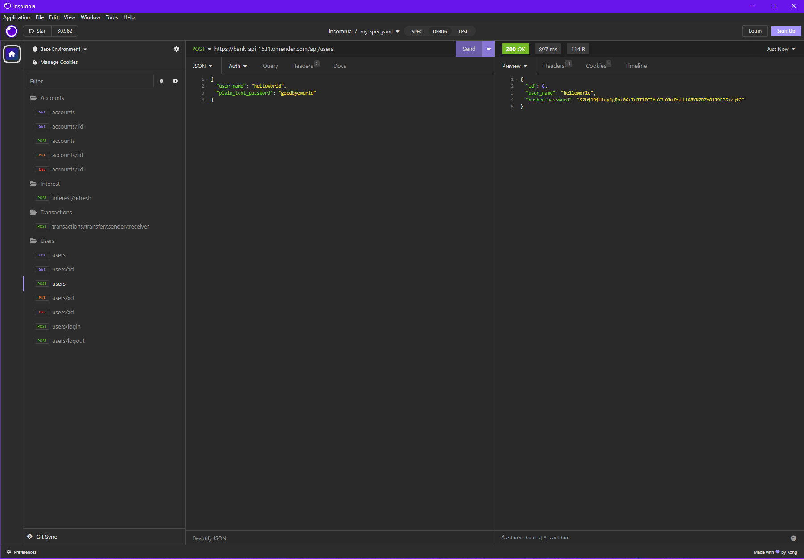

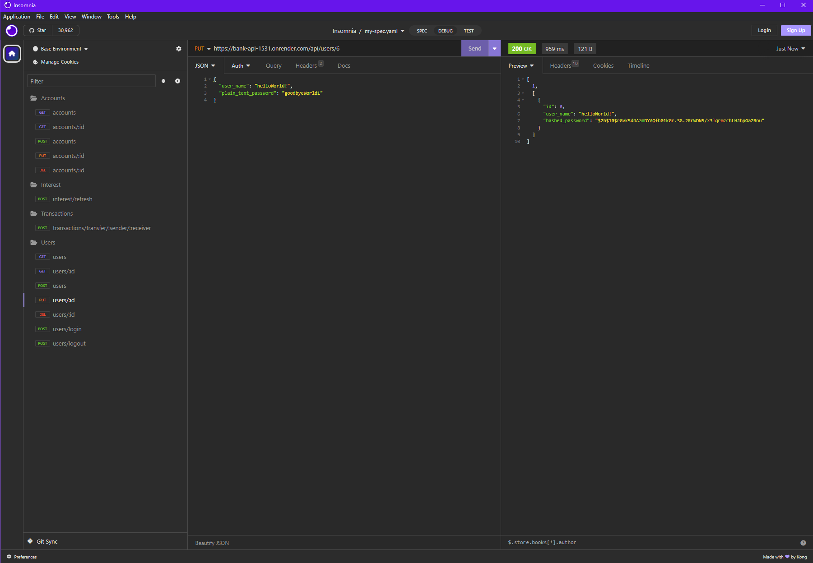

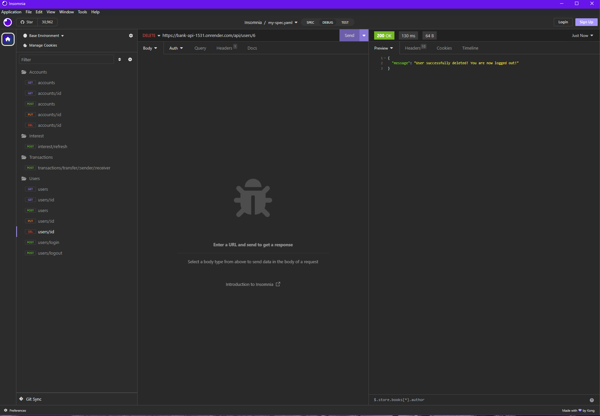

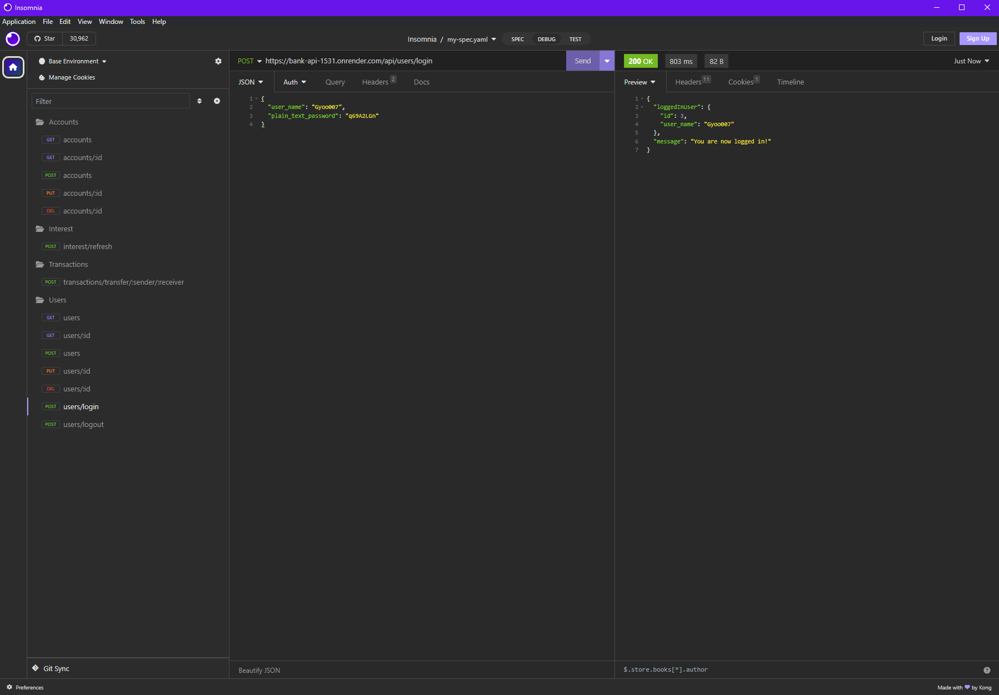

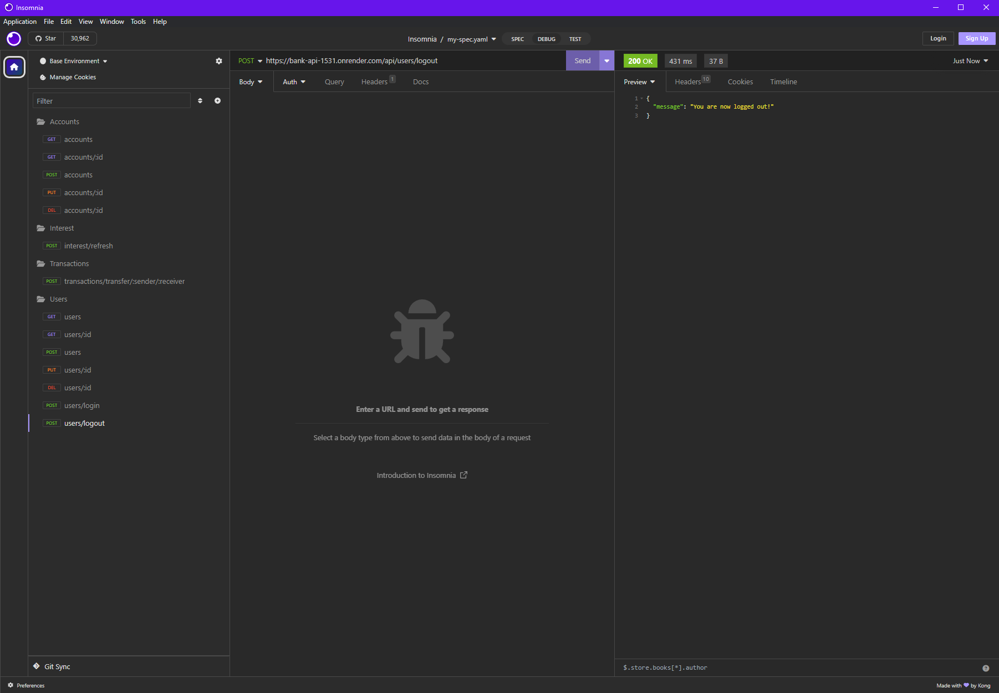

Interest:

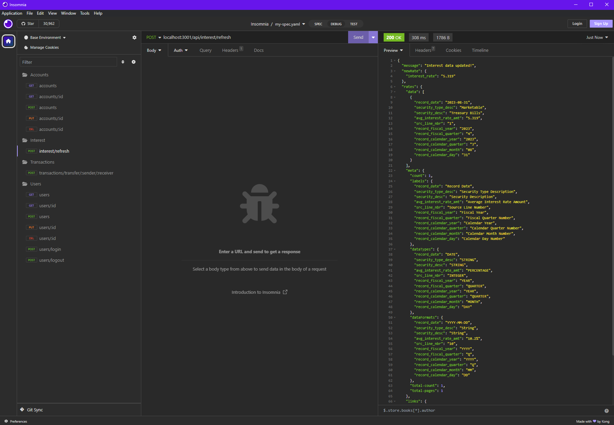

Transactions:

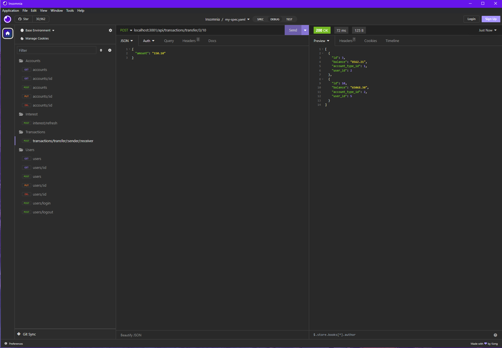
